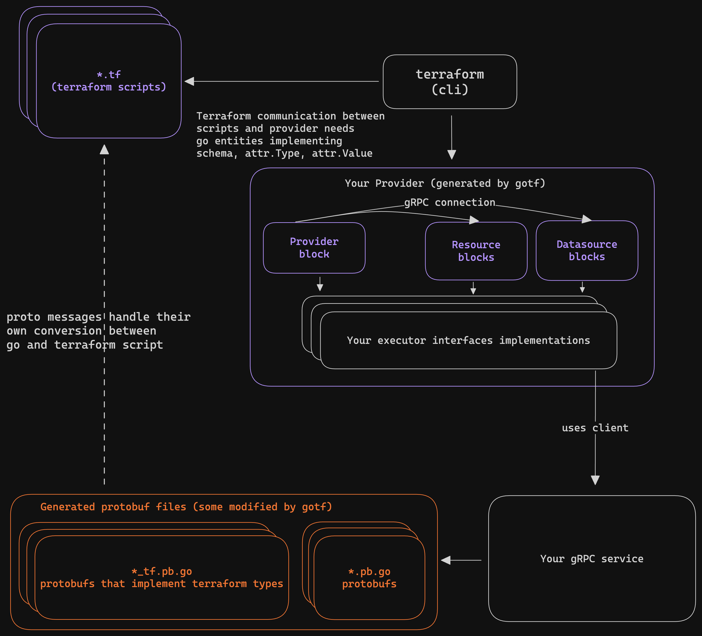

# Documentation

## Table of Contents

- [Overview](#overview)
- [Cli options] 🔗
- [Proto options] 🔗
- [Executor] 🔗
- [Usage] 🔗

## Overview

GoTF a protoc plugin generates go code for Terraform providers.
To generate the code, you need to set [Proto options] in your proto files and run `protoc` with `--gotf_out` option.

Relationships between the protobuf and terraform entities:

| Protobuf | Terraform             |
|----------|-----------------------|
| Message  | Block model, schema   |
| Field    | Block attributes      |
| Services | clients for executors |

Generated terraform code is a bridge between your service and terraform cli.
It requires an implementation of interfaces which are dynamically generated by GoTF plugin.
The interfaces are generated in the same package as the generated terraform go code.
The implementations of these interfaces are referred to as executor.
These executors perform the actual work of the provider.

Generated protobuf messages (go structs) are used to communicate between the terraform cli and the provider.

The model exchanged between terraform and provider is expected to implement schema, attr.Type and attr.Value interfaces
from the terraform plugin framework.
GoTF generates code that implements these interfaces for the generated protobuf messages (by implementing pointer
receiver methods for the messages) and places `*_tf.go` files in `go_package`.
This way the protobuf messages can be used as custom objects in terraform scripts.

GoTF also injects gRPC service clients to these executors if the resource or datasource message has a `client` option
set.
See [Executor] for more details.

[Cli options]: ./cli-options.md

[Proto options]: ./proto-options.md

[Executor]: ./executor.md

[Usage]: ./usage.md
